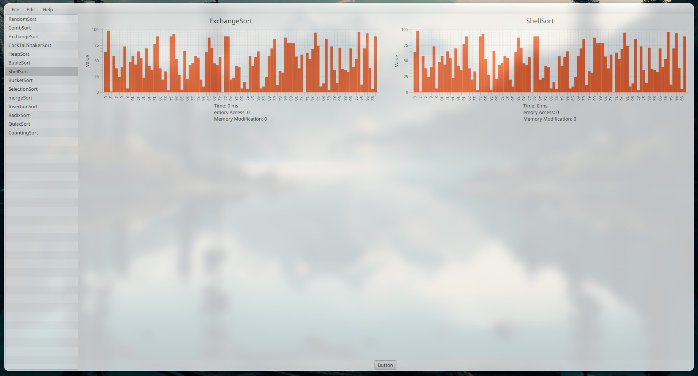

# sort-visualizer

A simple javaFX app to visualize sorting algorithms.

## Features

- Visualize sorting algorithms
- Change the speed of the visualization
- Change the size of the array
- Observes multiple sorting algorithms at the same time

## Sorting Algorithms

- Bubble Sort
- Selection Sort
- Insertion Sort
- Merge Sort
- Quick Sort
- Heap Sort
- Radix Sort
- Counting Sort
- Bucket Sort
- Shell Sort
- Comb Sort
- Random Sort
- Exchange Sort

## How to use

1. Clone the repository
2. Open the project in your favorite IDE
3. Run the project using mavens `javafx:run` goal
4. Select the sorting algorithms you want to observe
5. Click on the `Start` button to start the visualization

## Screenshots

